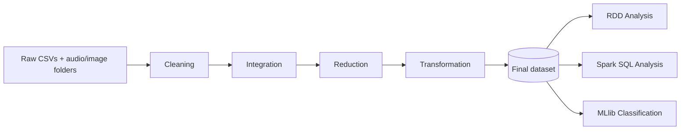

# 🎵 SonicSpark: Music Genre Classification with Apache Spark

> ###### [Overview](#overview) | [Dataset](#dataset) | [Pipeline](#pipeline) | [Repository Content](#repository-content) | [Getting Started](#getting-started) | [Results](#results) | [Team](#team) | [Caveats](#caveats) | [License](#license) | [Citing](#citing)


## Overview

**SonicSpark** investigates whether acoustic features extracted from short music segments carry enough information to reliably distinguish between music genres. The project builds an end-to-end big data workflow in **Apache Spark with Scala**, covering data preprocessing, exploratory analysis with **RDDs** and **Spark SQL**, and genre classification with **Spark MLlib**.


## Dataset

We use the **GTZAN Dataset – Music Genre Classification** from Kaggle, based on the original GTZAN collection by Tzanetakis and Cook. It contains 1,000 thirty-second audio tracks (22,050 Hz, mono, 16-bit), evenly split across 10 genres:

| Genre | Genre | Genre | Genre | Genre |
|---|---|---|---|---|
| Blues | Classical | Country | Disco | Hip-hop |
| Jazz | Metal | Pop | Reggae | Rock |

The dataset provides four related representations:

| Representation | Description | Used in this project |
|---|---|---|
| `genres_original/` | Raw `.wav` audio, one folder per genre | Consistency checks only |
| `images_original/` | Mel spectrogram images per track | Consistency checks only |
| `features_30_sec.csv` | 60 features per full 30-second track (1,000 rows) | Integration (track level) |
| `features_3_sec.csv` | 60 features per 3-second segment (9,990 rows) | **Main analytical table** |

Features include the mean and variance of chroma, RMS energy, spectral centroid, bandwidth, roll-off, zero-crossing rate, harmonic and percussive components, tempo, and 20 MFCCs.

> ⚠️ The dataset is **not included** in this repository. Download it from [Kaggle](https://www.kaggle.com/datasets/andradaolteanu/gtzan-dataset-music-genre-classification) and place its contents in `data/raw/`.

## Pipeline



| Phase | Description |
|---|---|
| 1. Data Selection | Dataset choice, schema, initial quality observations | 
| 2. Preprocessing | Cleaning, integration, reduction, transformation | 
| 3. RDD Operations | Low-level analyses with transformations and actions |
| 4. SQL Operations | Analytical queries using aggregations, window functions, CTEs |
| 5. Machine Learning | Multi-class genre classification with Spark MLlib | 

## Repository Content

```
SonicSpark/
├── build.sbt                  # Project definition and dependencies
├── project/build.properties   # sbt version
├── AUTHORS                    # Project team and credits
├── main/
│   ├── HelloSpark.scala       # Environment sanity check
│   ├── common/                # Shared SparkSession builder and file paths
│   ├── preprocessing/         # Phase 2: Cleaning, Integration, Reduction, Transformation
│   ├── rdd/                   # Phase 3: RDD analyses
│   ├── sql/                   # Phase 4: Spark SQL queries
│   └── ml/                    # Phase 5: ML pipeline and evaluation
├── data/                      # Local data only (git-ignored)
│   ├── raw/                   # Original Kaggle files
│   ├── interim/               # Intermediate pipeline outputs (Parquet)
│   └── processed/             # Final dataset used by all analyses
├── outputs/
│   ├── stats/                 # Before/after statistics
│   └── figures/               # Charts and visualizations
└── docs/                      # Project reports
```

## Getting Started

### Requirements

| Tool | Version |
|---|---|
| JDK | 17 |
| Scala | 2.12.18 |
| Apache Spark | 3.5.1 |
| sbt | 1.10.x |
| IDE | IntelliJ IDEA + Scala plugin |

### Run

```bash
git clone https://github.com/leen449/Big-Data-Systems.git
cd SonicSpark
# place the Kaggle files in data/raw/
sbt "runMain sonicspark.HelloSpark"
```

Expected output: `Rows: 9990 | Columns: 60`, a genre count table, and `RDD check (should be 10100): 10100`.

> **Windows users:** Spark requires `winutils.exe` and `hadoop.dll` in `%HADOOP_HOME%\bin`.

## Results

Model performance will be reported here after Phase 5, compared against a majority-class baseline (~10% accuracy on 10 balanced classes).

| Model | Accuracy | Macro F1 | Notes |
|---|---|---|---|
| Majority-class baseline | – | – | Reference point |
| Logistic Regression | – | – | Phase 5 |
| Random Forest | – | – | Phase 5 |

## Team

- Shahad Alotaibi
- Aryam Almutairi
- Leen Binmueqal
- Ryouf Alhuwaidi 

**Supervisor:** Dr. Afshan Jafri

## Caveats

- **Segment leakage.** Each 30-second track is split into ten 3-second segments that sound very similar to each other. If segments from the same track appear in both the training and test sets, accuracy is inflated. All splits in this project are done **by track**, not by segment.
- **Known GTZAN faults.** Sturm (2013) documented repeated excerpts, mislabelings, and distortions in GTZAN. Results should be read with this in mind.
- **Row count.** `features_3_sec.csv` contains 9,990 rows instead of 10,000.

## License

The **code** in this repository is released under the [MIT License](LICENSE).

The **dataset** is not redistributed here. Its terms are listed on the Kaggle page, and it is used strictly for non-commercial educational purposes. Only derived statistics, visualizations, and model results are published.

## Citing

If you refer to the GTZAN dataset, please cite the original work:

> G. Tzanetakis and P. Cook, "Musical genre classification of audio signals," *IEEE Transactions on Speech and Audio Processing*, vol. 10, no. 5, pp. 293–302, 2002.

```bibtex
@article{tzanetakis2002musical,
  title   = {Musical genre classification of audio signals},
  author  = {Tzanetakis, George and Cook, Perry},
  journal = {IEEE Transactions on Speech and Audio Processing},
  volume  = {10},
  number  = {5},
  pages   = {293--302},
  year    = {2002},
  doi     = {10.1109/TSA.2002.800560}
}
```

Related reading on dataset quality:

> B. L. Sturm, "The GTZAN dataset: Its contents, its faults, their effects on evaluation, and its future use," arXiv:1306.1461, 2013.

## Acknowledgments

King Saud University, College of Computer and Information Sciences, Department of Information Technology, IT462 Big Data Systems. Dataset published on Kaggle by Andrada Olteanu.
