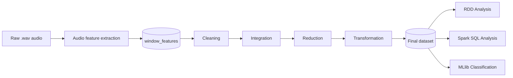

# 🎵 SonicSpark: Music Genre Classification with Apache Spark

> ###### [Overview](#overview) | [Dataset](#dataset) | [Pipeline](#pipeline) | [Repository Content](#repository-content) | [Getting Started](#getting-started) | [Results](#results) | [Team](#team) | [Caveats](#caveats) | [License](#license) | [Citing](#citing)


## Overview

**SonicSpark** investigates whether acoustic features extracted from short audio windows carry enough information to reliably distinguish between music genres. The project builds an end-to-end big data workflow in **Apache Spark with Scala**, covering audio feature extraction, data preprocessing, exploratory analysis with **RDDs** and **Spark SQL**, and genre classification with **Spark MLlib**.


## Dataset

We use the **GTZAN Dataset – Music Genre Classification** from Kaggle, based on the original GTZAN collection by Tzanetakis and Cook. It contains 1,000 thirty-second audio tracks (22,050 Hz, mono, 16-bit), evenly split across 10 genres:

| Genre | Genre | Genre | Genre | Genre |
|---|---|---|---|---|
| Blues | Classical | Country | Disco | Hip-hop |
| Jazz | Metal | Pop | Reggae | Rock |

The dataset provides four related representations:

| Representation | Description | Used in this project |
|---|---|---|
| `genres_original/` | Raw `.wav` audio, one folder per genre | **Primary input**: features are extracted directly from these files |
| `images_original/` | Mel spectrogram images per track | Consistency checks only |
| `features_30_sec.csv` | 60 features per full 30-second track (1,000 rows) | Integration (track-level label/length) |
| `features_3_sec.csv` | 60 features per 3-second segment (9,990 rows) | Validation only (see Caveats) |

Features are extracted in Spark from the raw audio, not read from the CSVs: each track is split into 59 half-overlapping 1-second windows, and each window yields 38 features — the mean and variance of RMS energy, zero-crossing rate, spectral centroid, bandwidth, roll-off, flatness, and 13 MFCCs. The CSVs' own chroma, harmonic/percussive, and tempo columns are not part of this feature set.

> ⚠️ The dataset is **not included** in this repository. Download it from [Kaggle](https://www.kaggle.com/datasets/andradaolteanu/gtzan-dataset-music-genre-classification) and place its contents in `data/raw/`.

## Pipeline


```mermaid
flowchart LR
    A[Raw .wav audio] --> B[Audio feature extraction]
    B --> C[(window_features)]
    C --> D[Cleaning]
    D --> E[Integration]
    E --> F[Reduction]
    F --> G[Transformation]
    G --> H[(Final dataset)]
    H --> I[RDD Analysis]
    H --> J[Spark SQL Analysis]
    H --> K[MLlib Classification]
```

| Phase | Description |
|---|---|
| 1. Data Selection | Dataset choice, schema, initial quality observations | 
| 2. Preprocessing | Audio feature extraction, cleaning, integration, reduction, transformation | 
| 3. RDD Operations | Low-level analyses with transformations and actions |
| 4. SQL Operations | Analytical queries using aggregations, window functions, CTEs |
| 5. Machine Learning | Multi-class genre classification with Spark MLlib | 

## Repository Content

```
Big-Data-Systems/
├── build.sbt                     # Project definition and dependencies
├── project/
│   └── build.properties          # sbt version
├── AUTHORS.md                    # Project team and credits
├── README.md                     # Project readme (this file)
├── HelloSpark.scala              # Environment sanity check (Spark + RDD)
├── FoundationCheck.scala         # Smoke test: CSV read, Parquet round-trip, metrics
├── Peek.scala                    # Inspect any stage's Parquet output
├── main/
│   ├── Explore.scala             # Ad-hoc exploratory analysis of features_3_sec.csv
│   ├── common/
│   │   ├── Spark.scala           # Shared SparkSession builder
│   │   ├── Paths.scala           # Central file path constants
│   │   ├── Schema.scala          # GTZAN feature table schema (CSV and window_features)
│   │   ├── AudioConfig.scala     # Audio extraction parameters (window/frame sizes, mel bands, ...)
│   │   ├── DataIO.scala          # CSV/Parquet read and write helpers
│   │   └── Metrics.scala         # Before/after stats tables, printed and saved as CSV
│   ├── preprocessing/            # Phase 2
│   │   ├── AudioFeatures.scala   # Stage 0: raw WAV -> window_features (RIFF parsing, FFT, MFCC)
│   │   ├── Cleaning.scala        # Stage 1: remove silent windows
│   │   ├── Integration.scala     # Stage 2: link windows to tracks, build tracks table
│   │   ├── Reduction.scala       # Stage 3: drop redundant/low-relevance features
│   │   ├── Transformation.scala  # Stage 4: feature engineering, log transform, label encoding
│   │   └── RunPreprocessing.scala # Runs stages 1-4 in order and prints a summary
│   ├── rdd/                      # Phase 3: RDD analyses
│   ├── sql/                      # Phase 4: Spark SQL queries
│   └── ml/                       # Phase 5: ML pipeline and evaluation
├── data/                         # Local data only (git-ignored)
│   ├── raw/                      # Original Kaggle files (CSVs, audio, images)
│   ├── sample/                   # ~11 WAV files (1/genre + the corrupt jazz file) for quick testing
│   ├── interim/                  # Intermediate pipeline outputs (Parquet)
│   │   ├── 00_window_features/   # Output of AudioFeatures: one row per 1-second window
│   │   ├── 01_cleaned/           # Output of Cleaning
│   │   ├── 02_integrated/        # Output of Integration (windows + track info)
│   │   ├── 02_tracks/            # One row per song, built during Integration
│   │   └── 03_reduced/           # Output of Reduction
│   └── processed/
│       └── final/                # Output of Transformation; analysis-ready dataset
├── outputs/
│   ├── stats/                    # Before/after metrics CSV per stage
│   └── figures/                  # Charts and visualizations
└── docs/                         # Project reports
```

## Getting Started

### Requirements

| Tool | Version |
|---|---|
| JDK | 17 |
| Scala | 2.12.18 |
| Apache Spark | 3.5.1 |
| sbt | 1.10.x |
| IDE | Vscode + Scala (Metals) extension|

### Run

```bash
git clone https://github.com/leen449/Big-Data-Systems.git
cd Big-Data-Systems
# place the Kaggle files in data/raw/

# 1. Setup checks
sbt "runMain sonicspark.HelloSpark"          # reads features_3_sec.csv directly; unrelated to the window pipeline below
sbt "runMain sonicspark.FoundationCheck"

# 2. Audio feature extraction: raw WAV -> window_features
sbt "runMain sonicspark.preprocessing.AudioFeatures"                         # quick test on data/sample (~11 files)
sbt "runMain sonicspark.preprocessing.AudioFeatures data/raw/genres_original" # full corpus: ~1 hour, writes data/interim/00_window_features

# 3. Full preprocessing pipeline (Cleaning -> Integration -> Reduction -> Transformation)
#    Reads data/interim/00_window_features, so step 2 (full corpus) must have run first.
sbt "runMain sonicspark.preprocessing.RunPreprocessing"

# 4. Run a single stage on its own
sbt "runMain sonicspark.preprocessing.Cleaning"

# 5. Inspect a stage's output
sbt "runMain sonicspark.Peek data/interim/02_integrated"
```

`HelloSpark` expected output: `Rows: 9990 | Columns: 60`, a genre count table, and `RDD check (should be 10100): 10100` — this only exercises `features_3_sec.csv` directly and is unrelated to the window-based pipeline below it. `FoundationCheck` verifies both raw CSVs read correctly and survive a Parquet round-trip unchanged.

Every pipeline stage (`AudioFeatures`, `Cleaning`, `Integration`, `Reduction`, `Transformation`) writes its output as a **Parquet folder** under `data/interim/` or `data/processed/`, not a CSV. Use `Peek <path>` to inspect the row count, schema, and a sample of any of these folders.

> **Windows users:** Spark requires `winutils.exe` and `hadoop.dll` in `%HADOOP_HOME%\bin`.

## Results

### Audio feature extraction

Full corpus (1,000 files): 999 parsed, 1 excluded (`jazz.00054.wav`, corrupt — missing RIFF tag), **58,942 windows** total (58–60 per track; 59 for a full-length track). Zero NaN, Infinite, or extreme values across all 38 feature columns. Validated against `features_3_sec.csv` on matched 3-second segments: Pearson r = 0.998 (RMS mean), 0.998 (spectral centroid mean).

### Preprocessing summary

| Stage | Rows | Columns | Time |
|---|---|---|---|
| Raw input (window_features) | 58,942 | 42 | - |
| Cleaning | 58,924 | 42 | 44.6 s |
| Integration | 58,924 | 44 | 39.5 s |
| Reduction | 58,924 | 41 | 48.3 s |
| Transformation | 58,924 | 43 | 71.7 s |

Source: `outputs/stats/00_pipeline_summary.csv`, generated by `RunPreprocessing`.

### Model performance (pending — Phase 5)

Model performance will be reported here after Phase 5, compared against a majority-class baseline (~10% accuracy on 10 balanced classes).

| Model | Accuracy | Macro F1 | Notes |
|---|---|---|---|
| Majority-class baseline | – | – | Reference point |
| Logistic Regression | – | – | Phase 5 |
| Random Forest | – | – | Phase 5 |

## Team

- Shahad Alotaibi
- Aryam Almutairi
- Leen Binmueqal
- Ryouf Alhuwaidi 

**Supervisor:** Dr. Afshan Jafri

## Caveats

- **Window leakage.** Each 30-second track is split into 59 half-overlapping 1-second windows (50% overlap) that are far more similar to each other than the old 3-second segments were. If windows from the same track appear in both the training and test sets, accuracy is inflated badly. All splits in this project are done **by track**, never by window.
- **Known GTZAN faults.** Sturm (2013) documented repeated excerpts, mislabelings, and distortions in GTZAN. Results should be read with this in mind.
- **`jazz.00054.wav` is corrupt.** Its RIFF header is unreadable (missing the "fmt " tag), so it is excluded entirely during audio extraction — 0 windows, confirmed directly by `AudioFeatures`'s error handling rather than just "reportedly corrupt." This is why `jazz` has 5,841 windows instead of ~5,900 like the other genres. It also has no spectrogram image, a separately known GTZAN issue with this recording.
- **Window count isn't a round number.** 999 of 1,000 tracks were extracted successfully (the exception above), and 17 tracks yield fewer than the expected 59 windows because they are slightly shorter than a full 30-second track — 58,942 windows total.
- **`features_3_sec.csv` row count.** Kept for reference: it has 9,990 rows instead of 10,000 for the same reason (10 recordings slightly shorter than 30 seconds), but this CSV is no longer the main analytical table — it is used only to validate the extracted features (see Results).

## License

The **code** in this repository is released under the [MIT License](LICENSE).

The **dataset** is not redistributed here. Its terms are listed on the Kaggle page, and it is used strictly for non-commercial educational purposes. Only derived statistics, visualizations, and model results are published.

## Citing

If you refer to the GTZAN dataset, please cite the original work:

> G. Tzanetakis and P. Cook, "Musical genre classification of audio signals," *IEEE Transactions on Speech and Audio Processing*, vol. 10, no. 5, pp. 293–302, 2002.

```bibtex
@article{tzanetakis2002musical,
  title   = {Musical genre classification of audio signals},
  author  = {Tzanetakis, George and Cook, Perry},
  journal = {IEEE Transactions on Speech and Audio Processing},
  volume  = {10},
  number  = {5},
  pages   = {293--302},
  year    = {2002},
  doi     = {10.1109/TSA.2002.800560}
}
```

Related reading on dataset quality:

> B. L. Sturm, "The GTZAN dataset: Its contents, its faults, their effects on evaluation, and its future use," arXiv:1306.1461, 2013.

## Acknowledgments

King Saud University, College of Computer and Information Sciences, Department of Information Technology, IT462 Big Data Systems. Dataset published on Kaggle by Andrada Olteanu.
